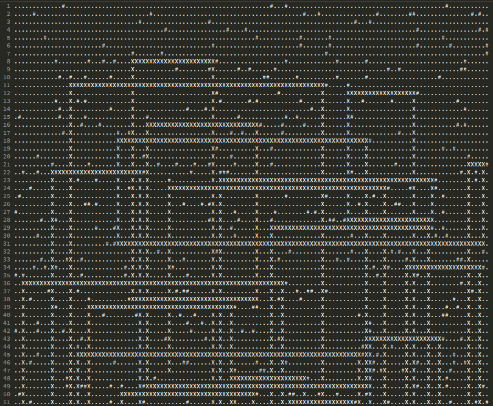

<style>

.astro-code {
    font-size: 16px;
    line-height: 1rem;
    padding: 18px;
    border-radius: 8px;
}

h3, hr {
    margin: 0.7em 0 0.5em 0
}

#full-text p {
    margin: 0.5em 0 1.2em 0;
}

figcaption {
    color: gray;
    margin-top: -0.8em;
    text-align: center;
    font-size: 0.9em;
}

#toc > ul {
    line-height: 2em;
}

li a {
    color: black;
}

table {
    border: 1px solid slategrey;
    padding: 4px;
    background-color: #f8f9fa;
    margin: 0.5em 0 1.2em 0;
}

th {
    text-align: left;
    white-space: nowrap;
}

td {
    text-align: left;
    white-space: nowrap;
}

</style>

### Introduction

Learning Emacs has always been a challenge. It is written in an unfamiliar language for many and most of the time there is more than one way to accomplish a task. While the manual exists practice makes it perfect.

When December rolled around, bringing with it Advent of Code, I thought as it is a tradition to tackle AoC challanges in obscure languages and environments, Emacs is a perfect candidate. Also the problems are text based, who deals with text better than Emacs? In this blog post, we'll explore three things that I found AoC helps us understand better about Emacs.

### Integrated Help

Two fundamental Emacs functions quickly became my best friends: `C-h f` and `C-h v`. What is the difference between `forward-line` and `forward-logical-line`? Just move your cursor on the name of the function and run `C-h f` (I had check it multiple times). This highlights an important aspect of Emacs: As a long-running project, it has accumulated many functions that seem similar but behave subtly different. So reaching out to helpers is an important habit. While I used variable help (`C-h v`) less, it was helpful for checking global variables.

### Buffers

I intentionally avoided converting text into matrices when solving grid-based problems because Emacs already has them, they are just called **buffers**. Buffers display text as lines and columns which makes it possible to them use them in grid operations. Guard problem (day 6) is a great example, I just used regular horizontal and vertical movement functions, rather than converting the text into a matrix.



```lisp
;; Check end of line and move one
;; point further
(defun move-east ()
  (if (not (eolp))
      (goto-char (+ (point) 1))
    (throw 'end t)))
```

### Lisp

Emacs is written in C and a special dialect of lisp called Emacs Lisp. With Emacs Lisp you can change and configure your Emacs. So, to fully benefit Emacs capabilities you have to learn Emacs Lisp. AoC thought me implementing common programming concepts in lisp. Variable and function declerations, control structres, recursive patterns… All I had to learn quickly to solve the puzzles. Check out this little example:

```lisp
(setq antenna-regexp "[[:alnum:]]")

(defun extract-antennas (buf)
  (let ((antennas (make-hash-table)))
    (with-current-buffer buf
      (goto-char (point-min))
      (defun extract-antennas-inner ()
	(while (re-search-forward antenna-regexp nil t)
	  (let* ((matched-char (string-to-char (match-string 0)))
		 (matched-position (list (line-number-at-pos) (- (current-column) 1)))
		 (val (gethash matched-char antennas)))
	    (puthash matched-char (cons matched-position val) antennas)))
	antennas)
      (extract-antennas-inner))))
```

Writing this was only possible on day 8 as writing little function involves understanding and combining these concepts:
- Functions
- Closures
- Scoped variables
- Buffers
- Regexp Search
- Hash Tables

### Summary

If you’re looking for a way to support reading the manual, I’d advise trying AoC with Emacs Lisp next year. Many concept you couldn’t fully grasp will became clearer. I’m hoping to get 25/25 next year, we’ll see how it goes. I’d love to hear your thoughts, thanks a lot for reading!
