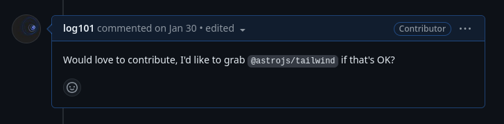
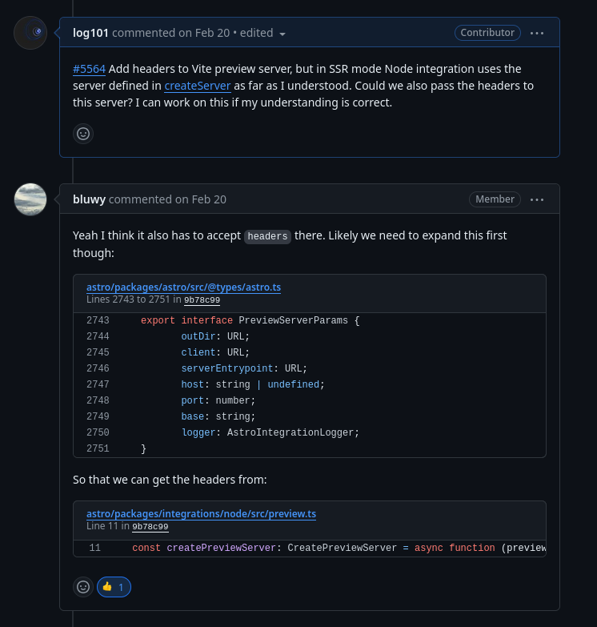

Yazılım projelerimizin belkemiği olan açık kaynak yazılımlar, kullanıma *açık* oldukları kadar geliştirmeye de *açıklar*. Ne var ki, bunları kullanması ne kadar kolaysa geliştirmesi de bir o kadar çetrefilli! Peki bunun bizi yıldırmasına müsaade edecek miyiz, tabi ki de hayır! Bu yazıda açık kaynak projelerde katkı sağlayıcı olmanın zorluklarını bir kenara bırakıp, bunun aslında bize sağlanmış bir özgürlük ve kendimizi geliştirmenin eğlenceli bir yolu olduğunu göreceğiz!

### Açık Kaynak

Açık kaynak yazılım, kabaca ifadesiyle herkesin dilediğince kullanabildiği, değiştirebildiği ve başkalarıyla paylaşabildiği kod anlamına geliyor [(1)](https://www.redhat.com/en/topics/open-source/what-is-open-source). Daha açık bir şekilde ifade edecek olursak: Bir yazılımın açık kaynak olması, bize bu yazılım ile alakalı üç türlü özgürlük sağlıyor:
1. Bu yazılımı projemiz içerisinde bir kütüphane veya çalıştırılabilir program olarak kullanabiliyoruz.
2. Bu yazılımın kodunda kalıcı düzenlemeler, ihtiyaçlarımız doğrultusunda eklemeler ve çıkarmalar yapabiliyoruz.
3. Yazılımın orijinal veya düzenlenmiş kopyalarını başkalarıyla paylaşabiliyoruz, hatta duruma göre satabiliyoruz [(2)](https://snyk.io/learn/open-source-licenses/).

İlk bakışta bu kimsenin kalkışmayacağı bir hayır işi gibi görünse de, projelerinin hızlı bir şekilde yaygınlaşmasını ve gelişmesini isteyen yazılımcılar ve yazılım firmaları bunları açık kaynak olarak paylaşmayı tercih edebiliyorlar. Bize de bunları *özgürce* kullanması kalıyor… veya değiştirmesi ve geliştirmesi! Girişte özgürlük derken ne kastettiğim herhalde şimdi daha iyi anlaşılmıştır. Açık kaynak yazılımlara katkı sağlamak yalnızca bir hayır işi veya vicdani sorumluluk olarak algılanmamalıdır. Bu yazılımlara katkı sağlayabilmek, ihtiyaçlarımız doğrultusunda bu yazılımlarda değişiklikler yapabilmek aslında bize sağlanmış bir özgürlüktür!

O halde artık açık kaynak projelere nasıl katkı sağlayabileceğimizden bahsedebiliriz. Katkı sağlayıcı olmanın çetrefilli yanları var ve katkıda bulunmak istediğiniz projelerle ilk kez karşılaştığınızda tedirgin olabilirsiniz; her işin başında olduğu gibi! İşte tam da bu noktada katkı sağlama sürecini tanımak işinizi kolaylaştıracak ve özgüveninizi arttıracak. Süreci iyi bir şekilde anladığınızda ne kadar tecrübesiz olursanız olun açık kaynak geliştiricisi olmanın mümkün, keyifli ve her açıdan gelişiminize katkı sağlayacak bir iş olduğunu göreceksiniz. Aynı zamanda size ilk katkımdan da bahsedeceğim, ne kadar da nostaljik!

### İlk Adımlar

Birinci adım açık kaynak bir projeyi gözümüze kestirmek. Projeyi uzaklarda aramanıza gerek yok. Daha önce yazdığınız bir projenin bağımlılıklarının olduğu dosyayı (package.json, go.mod vb.) açın. Burada bir liste halinde projede kullandığınız kütüphanelere rastlayacaksınız. Projeyi siz yazdıysanız bu kütüphanelerin az çok ne işe yaradığını biliyor olmalısınız, olmasanız da önemli değil, aralarından bir tanesini seçin. Sonra projenin adını bir arama motoruna yazın ve kütüphanenin kaynak kodunun barındırıldığı internet sayfasına gidin. Burası muhtemelen Github olacak.

Öncelikle, bu proje ile alakalı öğrenmeniz gereken üç bilgi var:
1. En son katkı (commit) ne zaman yapılmış.
2. Kaç katkı sağlayan (contributor) var.
3. Son ayda kaç katkı isteği (pull request) kabul edilmiş.

Eğer bu ilk katkınız olacaksa en geç 1 hafta önce güncellenmiş, en çok katkı sağlayan ve katkı isteği kabul edilmiş projeyi tercih etmenizi tavsiye ederim. Bu tür projelerin katkı sağlama süreçleri daha sistematik bir hale getirilmiş oluyor, yeni gelenlere daha hoşgörülü yaklaşılıyor ve katkı istekleri hızlı bir şekilde cevaplanıyor.

### Sorun

İlk adımı attıktan ve sizi heyecanlandıracak hareketli bir proje bulduktan sonra sırada bir sorun bulmak var. Korkmayın, durduk yere bir sorun çıkarmanıza gerek yok. Github vb. platformlarda her projenin sorunlar (issues) kısmı olur, burada projeden faydalanan insanlar, proje ile alakalı karşılaştıkları problemleri yazarlar. Bu kısımda biraz vakit geçirmeniz gerekebilir, projeye yeni katılmış biri olarak her sorunu anlamayabilirsiniz.

Hatırlarsanız size ilk katkımın hikayesini anlatacağım demiştim. Aynı bir önceki adımda size söylediğim şekilde ben de Astro ismindeki bir önyüz freymvörkünü (frontend framework) gözüme kestirmiştim. Birkaç günümü sorunlar kısmında, yeni açılan sorun başlıklarını inceleyerek geçirdim. Pek çoğunu nasıl çözebileceğime dair hiçbir fikrim yoktu. Bu durum canımı sıkmıştı.

Bir sabah yeni açılan bir başlık ile karşılaştım. Test kütüphanelerini değiştirdikleri için Astro’nun bazı testlerinin güncellenmesi gerekiyordu. Eski testler bu yeni kütüphane kullanılarak tekrar yazılacaktı. Başlığı açan kişi, bu sorunun projeye yeni dahil olmak isteyenler için iyi bir fırsat olduğunu da özellikle belirtmişti. Daha önce test yazdığımdan, ne yapılması gerektiğini kestirebiliyordum. Hemen yorumlar kısmında katkı sunmak istediğimi belirttim. Sırada, kodda gerekli değişiklikleri yapıp katkı isteğini göndermek vardı.

Sizin de bir sorunu seçtiğinizi varsayalım, dilerseniz sorun başlığının altına sorunla ilgilenmeye başladığınızı yorum olarak belirtebilirsiniz. Genellikle çözülmesi gereken sorun sayısı, katkı sağlayıcıların sayısından fazla olduğundan bunu yazmanıza bile gerek kalmayabilir.

<figcaption>Resim 1: Örnek bir yorum</figcaption>

### Triyaj

Genellikle projeler yapacağınız değişiklikleri orijinal kodda değil kendi kopyanızda (fork) yapmanızı isterler. Büyük projelerin kodunu düzenlemek tabiri caizse *kirli* bir iş olduğundan, proje sahipleri muhtemel karışıklıkların önüne geçmek adına kendi kopyanızdan çalışmanızı talep ederler. Neyse ki bir projenin kopyasını oluşturmak birkaç saniyelik oldukça basit bir iştir.

Bu aşamada ana klasörün altında `CONTRIBUTING.md` isminde bir doküman olup olmadığını kontrol etmeyi unutmayın. Bu dokümandan ilgili projede katkı sağlama sürecinin nasıl işlediğini ve nelere dikkat etmeniz gerektiğini öğrenebilirsiniz.

Kendi kopyanızı oluşturduktan sonra sıra, sorunun kaynağını tespit etmektir. Buna triyaj denir. Soruna yol açmış kodun bulunduğu dosyanın ismi bazen verilir, bazen de henüz tespit edilemediğinden verilmez. Bu durumda soruna neyin yol açtığını sizin tespit etmeniz beklenir.

Bunu tespit etmek için öncelikle sorunun açıklamasını dikkatlice okumalısınız. Eğer sorun başlığını açan kişi, sorunun nasıl ortaya çıktığını detaylı bir şekilde belirtmediyse bunu sormaktan asla çekinmeyin. Sorunun bütün yükünü omuzlamak zorunda değilsiniz. Sorunu detaylıca açıklamak, başlığı açan kişinin sorumluluğundadır. Pek çok proje raporlanan sorunun yeniden çıkarılabilir (reproducable) olmasını ister. Yani siz de sorunu yaşayan kişiyle aynı adımları takip ettiğinizde aynı hatayla karşılaşıyor olmalısınız.

### Çözüm

 Sorunu yeniden çıkardıktan sonra sıra bunu kaynağını tespit etmekte. Neyse ki hata ayıklama araçları bize hatanın muhtemel kaynaklarıyla alakalı detaylı bilgiler veriyor. Burada size düşen sanki zamanda geriye gider gibi, hatanın ortaya çıktığı fonksiyondan başlayarak fonksiyon çağrılarını geriye doğru takip etmek ve hangi parametrenin, değişkenin veya fonksiyon çağrısının sorunlu olduğunu bulmak.

 Benim ilk katkımda yalnızca bir test dosyasında değişiklik yapmam gerektiğinden bu aşamayı atlamıştım fakat çözdüğüm bir başka sorunda [(3)](https://github.com/withastro/astro/issues/10161) problemin kaynağı fonksiyonun eksik bir değer dönmesiydi. Değeri tamamladığımda hata da çözülmüş oldu. Sorunu çözmem için yalnızca 5 satır eklemem gerekiyordu!

Sorunun kaynağı olan değişkeni, parametreyi, fonksiyonu vb. tespit ettikten sonra bir çözüm üretmeye çalışın. Eğer bulduğunuz çözüm birden fazla dosyada değişiklik yapmanızı gerektiriyorsa ve işe yarayıp yaramayacağından emin değilseniz hemen sorun başlığına geri dönüp aklınızdaki fikri detaylı bir şekilde yorumlar kısmına yazın. Gereksiz yere vakit kaybetmektense projede tecrübe sahibi birinden geri bildirim almanız çok daha mantıklı olacaktır!

Sorunun kaynağını tespit ettiniz, gerekli değişiklikleri yaptınız ve artık aynı adımları tekrar uyguladığınızda sorunun ortadan kalktığını gördünüz! Öncelikle sizi tebrik ederim, zor bir işin üstesinden geldiniz. Fakat kötü bir haberim var, sorunun gerçekten ortadan kalktığına diğer yazılımcıları da ikna etmeniz gerekiyor. Bunun için çözümünüzü test etmelisiniz!

<figcaption>Resim 2: Örnek bir geri bildirim</figcaption>

### Test

Sorunu çözmeyi başardıysanız, test yazması da zor olmayacaktır. Yine de her proje farklı bir test düzeni takip ettiğinden projenizin testlerini nasıl kurguladığını öğrenmek biraz zaman alabilir. Diğer testleri örnek alarak testinizi yazmaya başlayın. Testiniz, sırayla sorunu aynı adımları takip ederek çıkarmaya çalışmalı ve kodun herhangi bir hata vermediğini göstermeli. Bu, aynı zamanda yaptığınız değişiklikleri geri aldığınızda testin hata vermesi gerektiği anlamına geliyor.

### Mutlu Son

Uzun soluklu ve yorucu bir süreçti ama artık ilk katkınızı yapmaya hazırsınız! Katkı isteğinizi atın ve beklemeye başlayın. Muhtemelen yaptığınız değişiklikler öncelikle bazı otomatik testlerden geçecek. Sonrasında katkı isteklerini değerlendirmekle görevli biri katkınızı inceleyecek ve yaptığınız değişiklikleri değerlendirecektir. Şanslıysanız isteğiniz hemen kabul edilir fakat zaman zaman görevli kişi sizden bazı düzenlemeler yapmanızı isteyebilir. Bu hevesinizi kırmasın, projenin uyum içerisinde çalışması için bütün katkıların belirli işlevsel ve estetik kriterlere uyması gerekiyor.

Düzenlemelerden sonra katkı isteğiniz kabul edilirse öncelikle derin bir nefes alın, sonra bilgisayarınızı kapatıp soğuk bir bardak su için. Aynaya bakıp gülümseyin ve yaptığınız değişikliklerin gelecek güncelleme ile beraber binlerce bilgisayara dalga dalga yayılacağını hayal edin.

Katkı sağlama sürecini son kez özetleyecek olursak:
1. Zevkinize uygun hareketli bir proje seçimi.
2. Sorunun (issue) seçimi.
3. Kendi kopyanızı (fork) oluşturma.
4. Triyaj, sorunun kaynağını tespit etme.
5. Çözümü uygulama.
6. Test etme.
7. Katkı isteği (pull request) gönderme.

Umarım anlattıklarım katkı sağlayıcı olma yolunda ilk adımı atmanızı kolaylaştırır. Emin olun ilk katkınızı yapmak sandığınızdan çok daha kolay olacak! Yazıyla alakalı geri bildirimlerinizi bekliyorum, bir başka yazıda görüşmek dileğiyle. 👋️

---

### Kaynaklar

1. https://www.redhat.com/en/topics/open-source/what-is-open-source
2. https://snyk.io/learn/open-source-licenses/
3. https://github.com/withastro/astro/issues/10161
